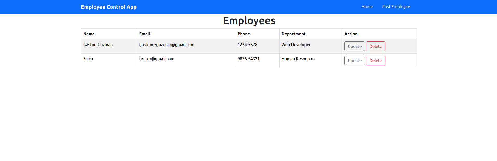
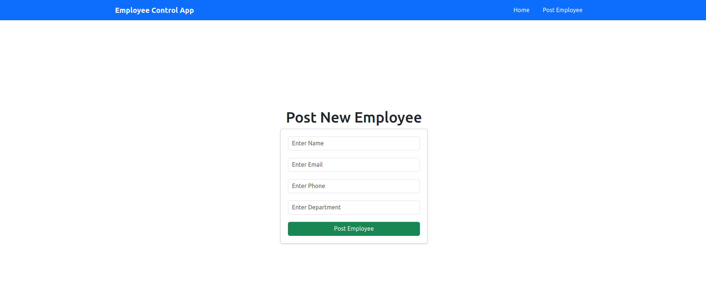

# Employee Control App - Frontend

Este proyecto es una interfaz web desarrollada con React + Vite y Bootstrap que permite visualizar, crear, actualizar y eliminar empleados. 

Se comunica con un backend en Spring Boot a través de una API REST y utiliza Axios para las solicitudes HTTP.

### Tecnologias Usadas
* React 19

* React Router DOM

* Axios

* Bootstrap / React-Bootstrap

* JavaScript (ES6+)

### Estructura del proyecto

> App.jsx: cabecera y configuracion principal de rutas

> src/components/  : componentes reutilzables (Header, Form, Table)

> src/pages/ :  paginas principales (dashboard, updateUser, PostUser)

> src/services/ : Logica de conexion con la API 

> public/ : imagenes para el icono y el GitHub

### Conexion con el Backend

En *src/services/**employeeService.jsx*** se encuentra la **API_URL** donde se conecta el frontend con el backend, si se ejecuta la aplicacion **localmente** cambiar a:
```
const API_URL = "http://localhost:8080/api/employee";
```

### Vista de la pagina
#### Pantalla Principal 


#### Pantalla para crear empleados


#### Autor: Gaston Guzman [linKedIn](https://www.linkedin.com/in/gaston-guzman-192730352/).

